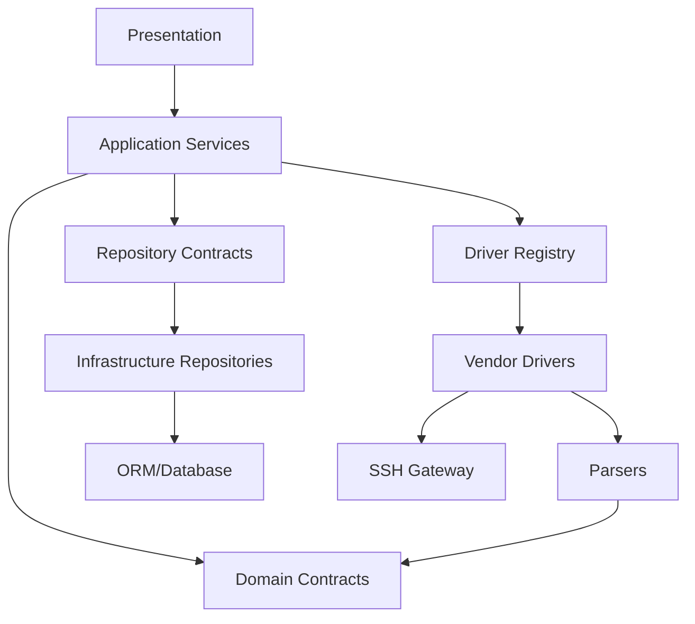

# Arquitetura Técnica do OpenNetManager

## 1. Objetivo

Este documento define a arquitetura interna do OpenNetManager como uma plataforma multi-vendor de gerenciamento operacional de access points e dispositivos de rede.

A arquitetura deve suportar, sem acoplamento estrutural a um fabricante:

- inventário e credenciais;
- coleta operacional via SSH;
- parsing e normalização;
- snapshots e histórico;
- configuração de SSID e rádio;
- DHCP, IP fixo e VLAN;
- reboot, reset, export e import;
- ping, traceroute, logs e configuração completa;
- clientes conectados e desautenticação;
- dashboard operacional;
- CLI controlada;
- auditoria de ações sensíveis.

O primeiro suporte concreto é o Extreme Networks AP130 via SSH, com fluxos CLI particularmente complexos. O Grandstream GWN7600 também possui suporte concreto. Essas integrações devem validar a arquitetura multi-vendor, não substituir seus contratos por lógica específica de um equipamento.

## 2. Estilo arquitetural

O projeto adota um monólito modular com camadas explícitas, inspirado em Clean Architecture, DDD Lite e separação rigorosa de responsabilidades.

A escolha por monólito modular evita complexidade prematura de rede, deployment e observabilidade distribuída. O isolamento é obtido por contratos, dependências direcionadas, services, repositories, drivers, parsers e testes arquiteturais.

### Princípios

- SOLID.
- Clean Architecture como referência de dependências.
- Repository Pattern para persistência.
- Service Layer para casos de uso.
- Driver Pattern para vendors.
- Parser Pattern para saída textual.
- Dependency Injection nas fronteiras centrais.
- DDD Lite para entidades, value objects e agregados.
- DRY, KISS e YAGNI.
- Nenhuma lógica de vendor em views ou no domínio genérico.

## 3. Camadas

### 3.1 Presentation Layer

Inclui views Django, templates, forms, serializers DRF, endpoints HTTP e componentes HTMX.

Responsabilidades:

- autenticar e receber intenção do usuário;
- validar formato básico de entrada;
- chamar services;
- apresentar dados e resultados;
- solicitar confirmação de operações sensíveis;
- exibir capability ausente e estados de operação.

Restrições:

- não acessa ORM diretamente;
- não abre SSH;
- não escolhe comandos;
- não contém regras de negócio profundas;
- não possui condicionais distribuídas por vendor.

### 3.2 Application Layer

É composta pelos services e coordena casos de uso.

Responsabilidades:

- autorização;
- validação de estado;
- verificação de capability;
- construção de diff;
- confirmação;
- controle de transações;
- resolução de driver;
- reconexão;
- verificação pós-operação;
- persistência;
- auditoria;
- tradução de falhas técnicas.

### 3.3 Domain Layer

Contém contratos e semântica estável:

- Device;
- Credential;
- Snapshot;
- WifiProfile;
- RadioConfiguration;
- NetworkConfiguration;
- VlanConfiguration;
- DeviceCapabilities;
- ClientData;
- DiagnosticResult;
- OperationResult;
- AuditEvent;
- enums e estados.

O domínio não depende de Django ORM, Paramiko, HTML ou formato de CLI.

### 3.4 Infrastructure Layer

Inclui:

- modelos ORM;
- repositories concretos;
- gateway SSH;
- driver registry;
- drivers de vendor;
- parsers;
- logging técnico;
- armazenamento de raw output;
- adaptadores externos.

## 4. Direção de dependências



A infraestrutura implementa contratos; regras de negócio não devem depender diretamente de detalhes externos.

## 5. Fluxos arquiteturais

### 5.1 Leitura e coleta

```text
View/API
→ SnapshotService
→ DeviceRepository
→ DriverRegistry
→ VendorDriver
→ SSHGateway
→ Parser
→ Domain Objects
→ SnapshotRepository
→ EventRepository
→ View/API
```

### 5.2 Configuração

```text
View/API
→ ConfigurationService
→ Authorization
→ Capability Check
→ Current State Reader
→ Diff Builder
→ Confirmation
→ VendorDriver
→ SSHGateway
→ Parser/Verification
→ ConfigurationSnapshot
→ AuditEvent
→ View/API
```

### 5.3 Mudança de IP ou VLAN

```text
Request
→ NetworkConfigurationService
→ Validate New State
→ Create Backup
→ Apply Through Driver
→ Mark Reconnecting
→ Discover/Reopen Session
→ Verify New Endpoint
→ Update Device Inventory
→ Persist Result
→ Audit
```

### 5.4 Diagnóstico

```text
View/API
→ DiagnosticService
→ Authorization
→ Capability Check
→ Driver ou Server Diagnostic Adapter
→ Normalized Diagnostic Result
→ Audit/History
→ View/API
```

O resultado deve indicar se o teste foi executado no servidor ou no dispositivo.

### 5.5 Operação sobre cliente

```text
View/API
→ ClientOperationService
→ Authorization
→ Capability Check
→ Confirmation
→ VendorDriver.disconnect_client()
→ Verify Client State
→ Event/Audit
→ View/API
```

## 6. Multi-vendor

A arquitetura utiliza quatro pilares:

1. Device com vendor, plataforma, modelo e firmware observados.
2. Driver base com operações de alto nível.
3. Parsers separados por comando e contexto.
4. Services sem semântica hardcoded de vendor.

Adicionar um vendor deve envolver:

- identificar modelo e capabilities;
- implementar driver concreto;
- implementar parsers;
- registrar driver;
- criar fixtures;
- criar testes unitários, integração e operação;
- documentar limitações.

### 6.1 Capability matrix

```python
class DeviceCapabilities:
    read_system_info: bool
    read_interfaces: bool
    read_clients: bool
    read_ssids: bool
    read_radios: bool
    read_logs: bool
    read_full_config: bool
    configure_ssid: bool
    configure_radio: bool
    configure_network: bool
    configure_vlan: bool
    reboot: bool
    reset_config: bool
    factory_reset: bool
    export_config: bool
    import_config: bool
    ping: bool
    traceroute: bool
    disconnect_client: bool
    cli_session: bool
```

Capabilities podem variar por modelo e firmware. O registry deve ser capaz de resolver o driver correto para os metadados disponíveis.

### 6.2 AP130

O AP130 pode exigir menus interativos, prompts, confirmação, múltiplas etapas e reconexão. Essa complexidade fica confinada ao driver, ao gateway de sessão e aos parsers próprios.

O domínio não deve saber se o driver executa um comando único ou uma sequência de comandos.

### 6.3 GWN7600

O GWN7600 utiliza parsers e comandos específicos. O suporte deve declarar apenas capabilities comprovadas pelo equipamento. A ausência de uma operação deve ser representada como `CapabilityNotSupported`, não como lista vazia ou sucesso artificial.

## 7. Drivers

Drivers podem:

- selecionar comandos controlados;
- executar sequências CLI;
- tratar prompts e menus;
- chamar parsers;
- devolver objetos de domínio;
- verificar resultado específico;
- controlar reconexão específica.

Drivers não podem:

- consultar ORM;
- autorizar usuário;
- renderizar HTML;
- persistir diretamente;
- montar shell arbitrário sem política;
- conter regra geral do produto.

## 8. Parsers

Parsers recebem saída bruta, contexto e metadados e retornam objetos de domínio ou erro semântico.

Características obrigatórias:

- determinismo;
- testes com fixtures;
- validação de campos críticos;
- tratamento explícito de saída incompleta;
- distinção entre ausência esperada e formato inválido;
- preservação de raw quando necessário.

Parsers nunca abrem conexão, executam comandos ou persistem.

## 9. Repositories

Repositories isolam ORM e consultas.

Responsabilidades:

- persistência de dispositivos;
- credenciais;
- snapshots;
- interfaces;
- clientes;
- eventos;
- operações;
- configurações;
- auditoria;
- consultas agregadas do dashboard.

Repositories não devem executar SSH, interpretar CLI ou aplicar autorização.

## 10. Operações e estados

Operações de alteração devem usar estados explícitos:

```text
pending
validating
awaiting_confirmation
executing
reconnecting
verifying
succeeded
partially_succeeded
failed
timeout
cancelled
```

O resultado deve incluir operation id, device, usuário, capability, timestamps, mensagem, erro, backup, snapshot e correlation id.

## 11. Segurança arquitetural

- autorização separada por capability;
- confirmação para alterações;
- auditoria imutável;
- secrets mascarados;
- comandos controlados;
- timeout e retry limitados;
- host key policy;
- backup antes de operações destrutivas;
- validação pós-aplicação;
- controle de acesso a logs e configuração completa.

## 12. Dashboard

O dashboard consome services e repositories. Ele não acessa SSH.

Métricas podem incluir:

- APs online/offline;
- clientes;
- SSIDs;
- rádios;
- upload/download;
- top clientes;
- top SSIDs;
- clientes com pior sinal;
- falhas de coleta;
- eventos;
- última atualização.

Cada métrica deve possuir janela, origem e timestamp.

## 13. API e UI

API e UI devem utilizar os mesmos contratos de aplicação. A API deve retornar:

- dados normalizados;
- capabilities;
- estados de operação;
- erros semânticos;
- timestamps;
- origem dos diagnósticos;
- segredos sempre mascarados.

## 14. Persistência

SQLite é usado no desenvolvimento e PostgreSQL em produção.

Devem ser considerados:

- constraints;
- índices para device/time/vendor/status;
- JSON para payload/raw controlado;
- retenção de snapshots e logs;
- diferenças entre engines;
- migrações reversíveis quando possível.

O dashboard deve usar consultas agregadas por repository. Redis não é requisito estrutural da primeira execução.

## 15. Observabilidade

Logs estruturados devem incluir:

- timestamp;
- nível;
- device;
- vendor;
- operação;
- capability;
- correlation id;
- duração;
- resultado;
- categoria do erro.

Segredos e payloads sensíveis devem ser mascarados.

## 16. Testes arquiteturais

A suíte deve impedir:

- ORM em views;
- SSH no dashboard;
- parser importando transporte;
- driver persistindo diretamente;
- service emitindo comandos específicos de vendor;
- operação sem capability;
- operação destrutiva sem confirmação;
- segredo em resposta;
- atualização de IP sem reconexão e verificação.

## 17. Evolução

A arquitetura deixa fronteiras para:

- scheduler;
- execução assíncrona;
- Redis;
- plugins;
- novos transportes como SNMP, NETCONF ou gNMI;
- novos vendors.

Esses componentes não devem ser introduzidos antes de os contratos atuais estarem estabilizados.
