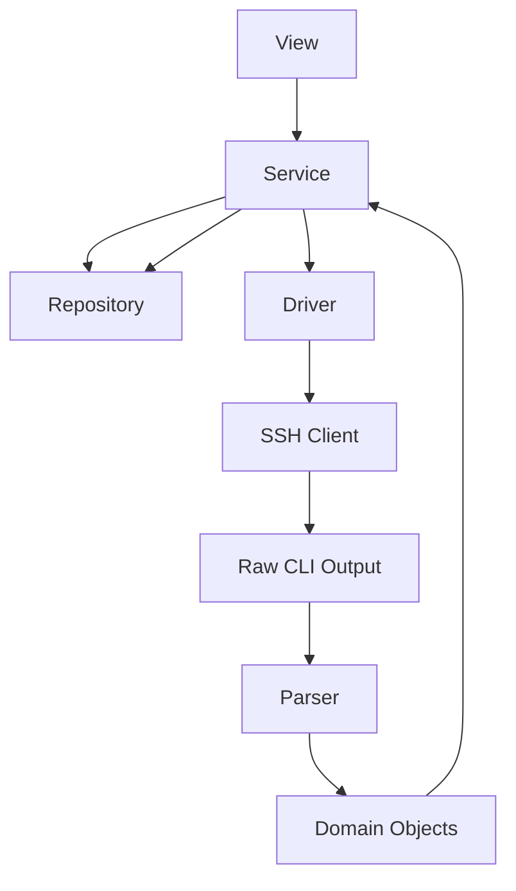
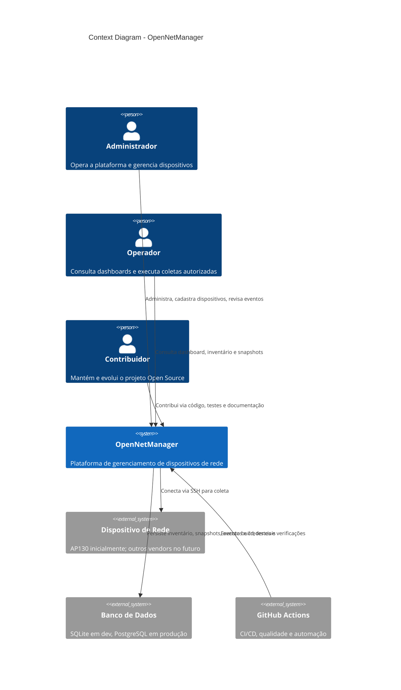
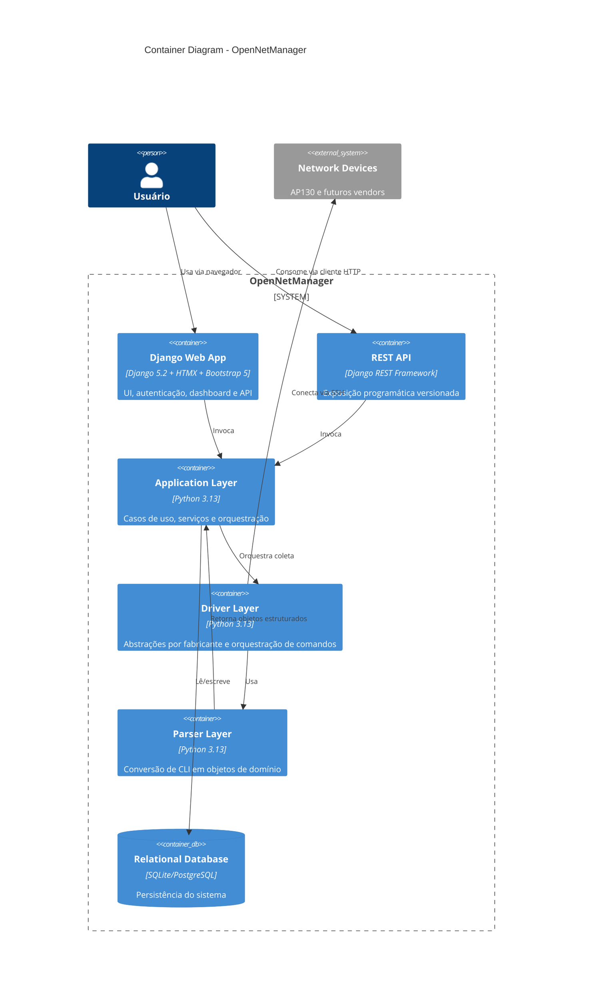
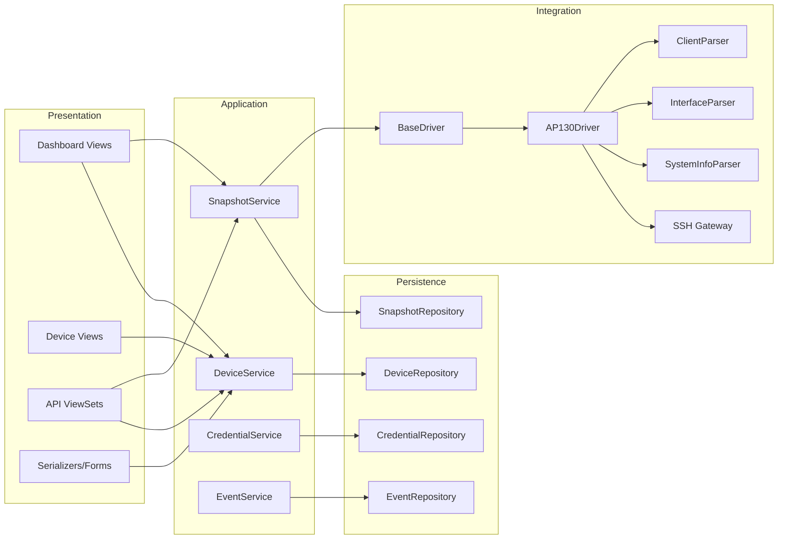
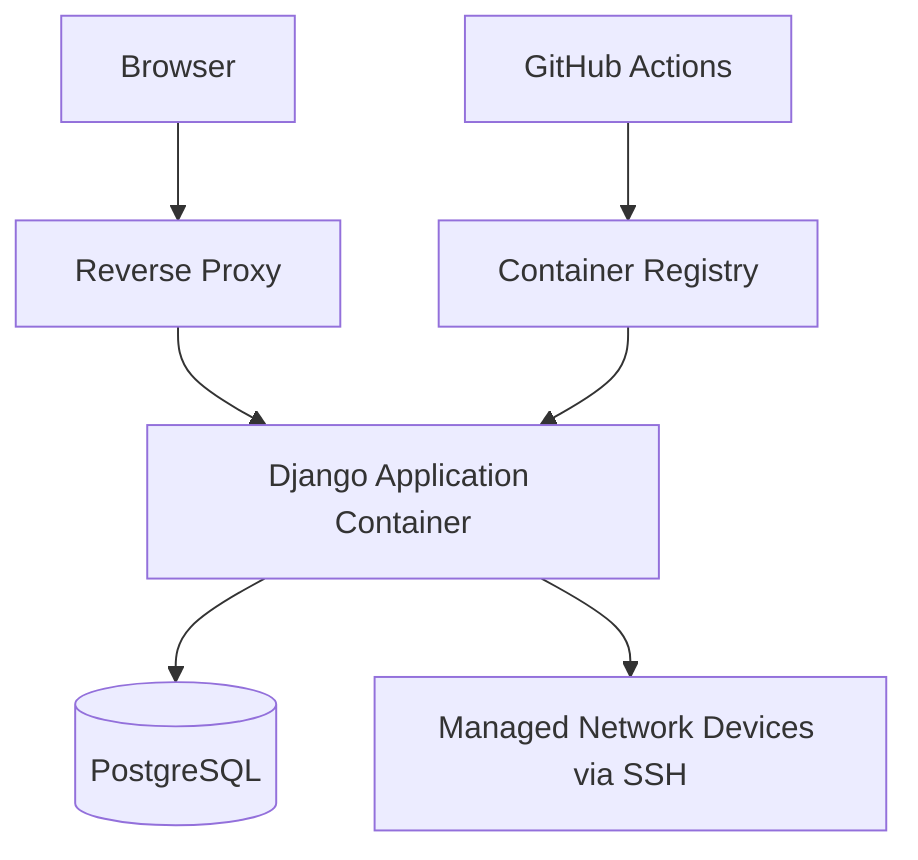

# Arquitetura do OpenNetManager

## Propósito arquitetural

A arquitetura do OpenNetManager foi desenhada para permitir gerenciamento de dispositivos de rede por múltiplos fabricantes sem acoplamento entre a lógica de negócio e o protocolo, o fornecedor ou o formato textual da resposta remota. O suporte inicial ao AP130 via SSH é tratado como uma implementação concreta de uma abstração mais ampla, não como o centro do sistema.

## Drivers arquiteturais

Os principais drivers arquiteturais do sistema são:

- Multi-vendor desde a origem.
- Evolução incremental sem reescrita estrutural.
- Separação estrita de responsabilidades.
- Baixo acoplamento entre UI, domínio e infraestrutura.
- Testabilidade elevada por unidade e por integração.
- Segurança por padrão para credenciais e acesso administrativo.
- Operação simples na Fase 0, com caminho claro para escalar.

## Estilo adotado

O sistema adota uma combinação pragmática de arquitetura em camadas com princípios de Clean Architecture e DDD Lite. A solução usa fronteiras explícitas entre apresentação, aplicação, domínio e infraestrutura, porém sem introduzir complexidade excessiva de um framework arquitetural próprio.

### Camadas lógicas

| Camada | Responsabilidade | Pode conhecer | Não pode conhecer |
|---|---|---|---|
| View | Receber requisição HTTP, validar entrada superficial, invocar serviços, retornar HTML/JSON | DTOs, serializers, services | ORM direto, SSH, parsers |
| Service | Orquestrar casos de uso, invariantes, políticas e transações | repositories, drivers, domain objects | detalhes de template, request HTTP bruto |
| Repository | Persistência e consulta | models, query building, transações | transporte SSH, parsing de CLI |
| Driver | Orquestrar comandos por fabricante e tipo de coleta | ssh client abstractions, parsers, domain objects | ORM, templates, regras de UI |
| SSH | Gerenciar sessão remota, autenticação, execução e erros de transporte | Paramiko, políticas de conexão | persistência, parsing de negócio |
| Parser | Converter saída bruta em objetos estruturados | schemas de parser, domain objects | conexão, ORM, request web |
| Domain Objects | Representar entidades e estruturas de negócio | tipos e invariantes de domínio | detalhes de infraestrutura |

## Fluxo principal

O detalhe importante é que o serviço orquestra tanto leitura em repositório quanto coleta por driver; o repositório não invoca driver e o driver não persiste dados. Esse desenho reduz ciclos indevidos, evita vazamento de infraestrutura para a apresentação e permite testes isolados por contrato.

## Organização estrutural

### Apps Django

- `authentication/`: login, logout, autorização e perfis de acesso.
- `dashboard/`: páginas de visão operacional e navegação principal.
- `devices/`: cadastro, credenciais associadas e detalhes de inventário.
- `monitoring/`: snapshots, jobs, eventos e histórico de coleta.
- `api/`: endpoints REST, serializers e versionamento.

### Pacotes transversais

- `core/`: contratos centrais, utilitários arquiteturais e componentes compartilhados.
- `drivers/`: abstrações e implementações por fabricante.
- `services/`: casos de uso e orquestração de aplicação.
- `repositories/`: persistência desacoplada do domínio de uso.
- `parsers/`: parsing por contexto e fabricante.
- `ssh/`: transporte, conexão, política de timeout e retries.
- `exceptions/`: hierarquia de erros de negócio e infraestrutura.
- `constants/`: enums e constantes funcionais.
- `cache/`: futuras abstrações de cache.
- `logging/`: configuração estruturada de logs.
- `config/`: settings, ambiente, bootstrap e configuração de deploy.

## Abstrações centrais

### 1. Device Vendor Abstraction

Todo dispositivo deve declarar um `vendor`, um `platform` e um `capability profile`. Essa distinção é importante porque fabricante e plataforma nem sempre se relacionam de forma unívoca no futuro. O trade-off é um modelo um pouco mais rico na origem, porém ele evita remodelagem quando surgirem linhas diferentes dentro do mesmo fabricante.

### 2. Driver Contract

Um driver representa a capacidade de conectar e coletar dados de uma plataforma específica. Ele não modela persistência nem HTTP. A interface mínima do driver deve prever:

- validação de suporte ao dispositivo;
- coleta de `system_info`;
- coleta de `interfaces`;
- coleta de `clients` quando suportado;
- execução de snapshot agregada;
- normalização de erros de transporte.

### 3. Parser Contract

O parser recebe texto bruto e contexto do comando. Sua única responsabilidade é converter saída textual em objetos estruturados ou lançar exceções de parsing semanticamente úteis. O trade-off é multiplicar classes pequenas, mas isso reduz muito o acoplamento com mudanças de firmware.

### 4. Repository Contract

Repositories encapsulam queries, save/update, lock lógico e mapeamento entre modelos persistidos e necessidades da aplicação. O uso do padrão evita espalhar ORM por views e serviços. O trade-off é criar uma camada adicional, porém esse custo é aceitável em troca de legibilidade, testabilidade e intercambialidade de persistência.

## Diagrama de contexto

## Diagrama de containers

## Diagrama de componentes

## Diagrama de implantação

## Trade-offs principais

### Camadas explícitas versus velocidade bruta inicial

Criar serviços, repositórios, drivers e parsers desde o início custa mais do que concentrar lógica em views e models. Mesmo assim, o projeto exige essa disciplina porque o domínio multi-vendor, o parsing textual e a coleta remota criam complexidade real cedo demais para tolerar atalhos sem dívida arquitetural severa.

### Django monolítico versus microsserviços

Um monólito modular foi escolhido para a Fase 0 por reduzir complexidade operacional, facilitar testes integrados e acelerar governança de domínio. O trade-off é menor independência de deploy por componente, mas isso é aceitável enquanto o produto valida o núcleo funcional.

### SSH síncrono na fase inicial versus fila assíncrona desde o início

A Fase 0 pode operar com coleta síncrona controlada e jobs persistidos sem exigir Redis imediatamente, o que simplifica bootstrap. O trade-off é throughput menor em cenários massivos; por isso a documentação preserva uma rota clara para futuras execuções assíncronas com Redis e scheduler dedicado.

## Restrições não negociáveis

- Nenhum código poderá depender semanticamente do AP130 fora do driver e parser específicos.
- Nenhuma view poderá acessar model manager ou queryset diretamente.
- Nenhum parser poderá abrir sessão SSH ou persistir estado.
- Nenhum driver poderá construir resposta HTML ou serialização REST.
- Credenciais nunca poderão ser exibidas em texto claro após persistência.
- Logs nunca poderão vazar segredo, senha, chave privada ou comando sensível com material secreto embutido.

## Evolução prevista

A arquitetura já antecipa:

- inclusão de múltiplos vendors;
- scheduler persistido;
- cache seletivo;
- API pública versionada;
- coletas em background;
- observabilidade mais completa;
- aumento gradual do rigor de segurança e compliance.

Essa antecipação deve orientar a modelagem, mas não justificar complexidade prematura onde YAGNI indicar postergação.
