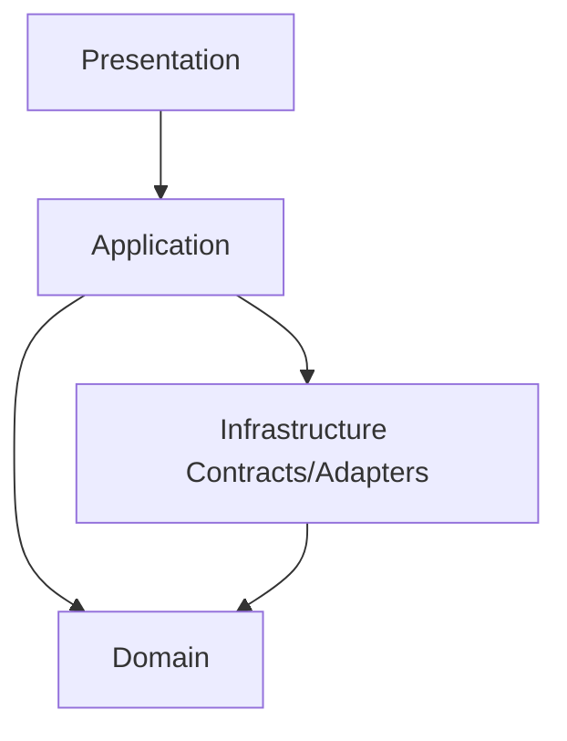
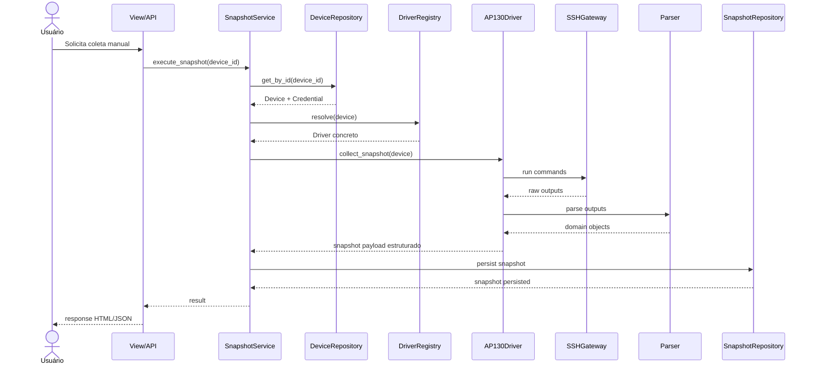
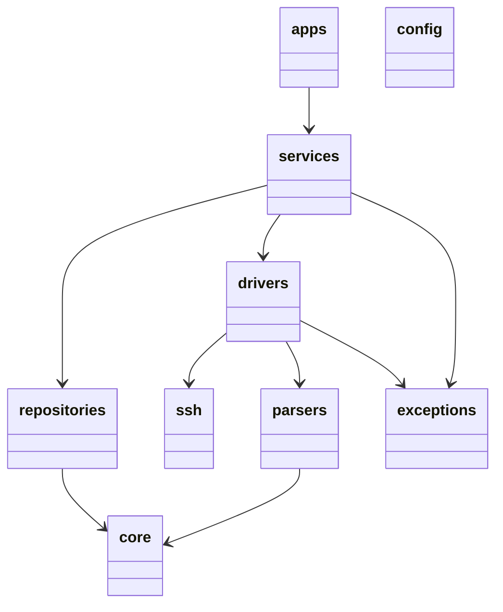

# Arquitetura Técnica

## Objetivo

Este documento expande a visão macro de `ARCHITECTURE.md` com detalhamento técnico da estrutura interna do OpenNetManager para orientar a implementação da Fase 0.

## Estilo arquitetural

O OpenNetManager adota um monólito modular com camadas explícitas. A escolha busca equilibrar clareza, velocidade de entrega, simplicidade operacional e baixo acoplamento. Em vez de microsserviços prematuros, a arquitetura favorece modularidade interna forte, contratos claros e evolução incremental.

## Princípios de desenho aplicados

- dependências apontam para camadas mais internas ou mais estáveis;
- regras de negócio não dependem de SSH, HTML ou ORM diretamente;
- variações de vendor são encapsuladas por drivers e parsers;
- persistência é mediada por repositories;
- acesso externo ocorre via views e API, nunca diretamente ao domínio.

## Camadas detalhadas

### Presentation Layer

Responsável por views Django, templates, forms, serializers DRF e endpoints HTTP. Deve converter entrada externa em chamadas de serviço e produzir resposta adequada. Não contém regra de negócio profunda nem detalhes de persistência.

### Application Layer

Responsável por serviços de caso de uso. Aqui residem orquestração, políticas, fluxos transacionais, validação de regras e coordenação entre repositórios, drivers e componentes auxiliares.

### Domain Layer

Responsável por entidades conceituais, value objects, enums, políticas de domínio simples e contratos estáveis usados pelas camadas superiores. Na Fase 0, adota-se DDD Lite: suficiente para nomear bem o problema, sem burocratizar demais o código.

### Infrastructure Layer

Responsável por ORM, repositórios concretos, SSH, drivers, parsers, logging técnico e integrações. Esta camada implementa contratos definidos mais acima e concentra variabilidade externa.

## Dependência permitida

A representação acima é conceitual. Na prática do repositório, algumas estruturas coexistem em pacotes top-level; por isso disciplina de dependência é mais importante que mera posição física em diretórios.

## Estratégia para multi-vendor

A estratégia multi-vendor baseia-se em quatro pilares:

1. `Device` com metadados explícitos de vendor e plataforma.
2. `BaseDriver` com capacidades abstratas.
3. `Parser` segmentado por comando/contexto.
4. `Service` orquestrando o fluxo sem semântica de vendor hardcoded.

### Consequência positiva

Adicionar um novo fabricante tende a consistir em:

- mapear capabilities;
- implementar driver concreto;
- implementar parsers necessários;
- registrar a resolução do driver;
- acrescentar testes e fixtures.

### Trade-off

Essa abordagem cria mais classes e contratos desde cedo. Contudo, o domínio de equipamentos heterogêneos justifica esse custo, pois o ganho de isolamento de mudança supera a sobrecarga inicial.

## Resolução de driver

A resolução de driver deve ocorrer em uma factory ou registry central, a partir de vendor/plataforma/capability. A resolução não deve ficar espalhada por views nem por serviços arbitrários. Isso reduz branching repetitivo e facilita evolução para plugins futuros.

## Sequence Diagram

## Package Diagram

## Componentes transversais previstos

- logging estruturado;
- exceptions hierárquicas;
- constants e enums;
- helpers de tempo e serialização;
- cache abstraído para evolução futura;
- scheduler desacoplado da camada web.

## Persistência dupla SQLite/PostgreSQL

A documentação assume SQLite para desenvolvimento local e PostgreSQL para produção. Django 5.2 suporta múltiplas versões recentes de Python e PostgreSQL 14+, o que reforça a compatibilidade da stack alvo.[web:1] O trade-off é tratar diferenças de comportamento entre SQLite e PostgreSQL, especialmente em constraints, tipos e desempenho; por isso testes críticos devem incluir PostgreSQL na CI.[web:1]

## Considerações de evolução

- Redis não deve ser exigido para a primeira execução local.
- Scheduler não deve depender estruturalmente do request/response web.
- API e dashboard devem consumir os mesmos serviços de aplicação.
- Toda regra de domínio compartilhada deve viver abaixo da camada de apresentação.
