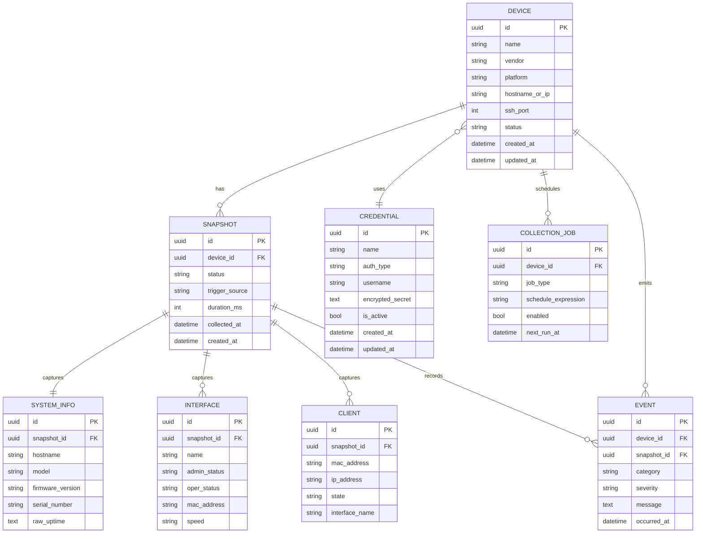

# Banco de Dados

## Objetivo

Definir a estratégia de persistência relacional do OpenNetManager e orientar modelagem inicial compatível com SQLite em desenvolvimento e PostgreSQL em produção.

## Estratégia geral

A persistência da Fase 0 usa Django ORM sobre banco relacional com dois perfis:

- SQLite para desenvolvimento local, onboarding simples e testes rápidos.
- PostgreSQL para produção, CI principal e cenários com requisitos mais fortes de integridade e desempenho.

Django 5.2 suporta PostgreSQL 14+ e mantém compatibilidade com SQLite, o que torna essa dupla adequada para o projeto.[web:1] A decisão equilibra simplicidade de bootstrap com robustez operacional, embora exija disciplina para não depender acidentalmente de comportamentos permissivos do SQLite.[web:1]

## Trade-offs da estratégia dual

### Benefícios

- setup local simples;
- menor barreira para contribuidores;
- produção com banco mais robusto;
- caminho gradual de maturidade operacional.

### Custos

- diferenças semânticas entre engines;
- risco de testes passarem em SQLite e falharem em PostgreSQL;
- necessidade de validar migrations e constraints no banco alvo de produção.

## Diretrizes de modelagem

- preferir chaves primárias estáveis e não dependentes do vendor;
- usar constraints explícitas para unicidade relevante;
- registrar timestamps de criação e atualização em entidades persistentes importantes;
- preservar histórico de coleta via snapshots, não sobrescrever tudo em estado atual;
- evitar JSON como fuga prematura para dados que merecem semântica própria.

## Entidades persistidas da Fase 0

- Device
- Credential
- Snapshot
- SystemInfo
- Interface
- Client
- Event
- CollectionJob

## ER Diagram

## Regras de integridade sugeridas

- `Device.name` deve ser único no escopo operacional definido.
- `Device(hostname_or_ip, ssh_port)` deve ter unicidade conforme política do ambiente.
- `Credential.name` deve ser único ou ao menos identificável de forma inequívoca.
- `Snapshot.device_id + collected_at` deve ser indexado.
- `Interface(snapshot_id, name)` deve ser único.
- `Client(snapshot_id, mac_address, interface_name)` pode exigir unicidade composta conforme semântica do vendor.

## Índices iniciais recomendados

- `Device.vendor`
- `Device.platform`
- `Device.status`
- `Snapshot.device_id, collected_at desc`
- `Event.device_id, occurred_at desc`
- `CollectionJob.enabled, next_run_at`

## Estratégia para dados brutos

Embora o sistema trabalhe com parsing estruturado, é recomendável reservar estratégia para retenção opcional de raw outputs de coleta, pelo menos para debug controlado. O trade-off é custo de armazenamento e sensibilidade de dados; portanto retenção de raw payloads deve ser explícita, limitada e protegida.

## Migrations

- toda mudança de schema deve ter migration revisável;
- migrations devem ser determinísticas e idempotentes no ciclo esperado do Django;
- alterações destrutivas exigem justificativa, plano de rollback e atualização documental.
