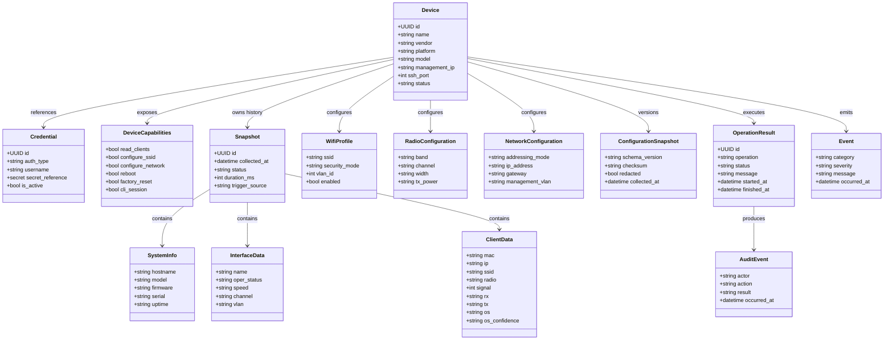
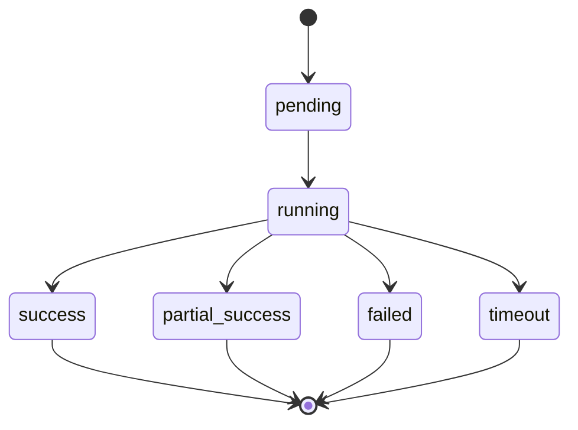
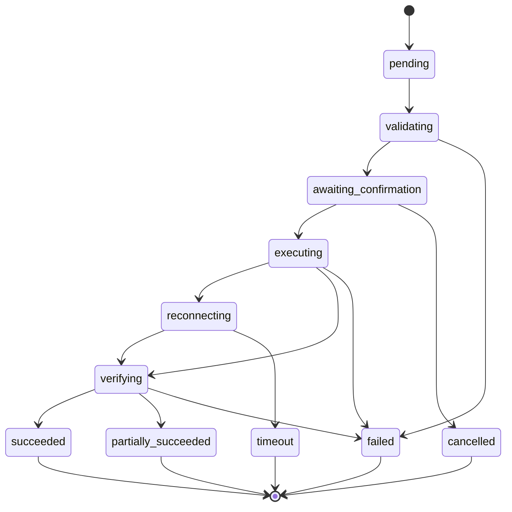

# Modelo de Domínio do OpenNetManager

## 1. Objetivo

Este documento define o modelo conceitual do OpenNetManager como plataforma de gerenciamento operacional multi-vendor. O modelo deve orientar entidades persistidas, objetos de domínio, contratos de service, payloads de API, parsers, drivers, auditoria e evolução futura.

O domínio precisa distinguir:

- identidade administrativa do dispositivo;
- estado operacional observado;
- configuração desejada e configuração aplicada;
- fatos históricos coletados;
- operações executadas;
- ações de usuários;
- capacidades reais do vendor.

## 2. Princípios de modelagem

- Nomear pelo significado operacional, não pelo comando de um vendor.
- Distinguir estado atual, estado observado e estado desejado.
- Preservar histórico e não sobrescrever fatos coletados.
- Representar capabilities explicitamente.
- Evitar `dict` genérico quando a semântica for conhecida.
- Usar extensões controladas para vendor-specific options.
- Separar segredo de configuração comum.
- Associar métricas a timestamp, origem e janela.
- Modelar operações destrutivas como entidades rastreáveis.
- Permitir resposta explícita para capability ausente.

## 3. Entidades principais

### 3.1 Device

Representa o ativo gerenciado e é o agregado-raiz do inventário.

Atributos conceituais:

- `id`;
- `name`;
- `hostname`;
- `management_ip`;
- `vendor`;
- `platform`;
- `model`;
- `firmware`;
- `ssh_port`;
- `status`;
- `administrative_state`;
- `credential_ref`;
- `driver_key`;
- `environment`;
- `tags`;
- `description`;
- `last_seen_at`;
- `last_snapshot_id`;
- `created_at`;
- `updated_at`.

Responsabilidades:

- identificar o ativo;
- fornecer metadados para resolução de driver;
- controlar elegibilidade operacional;
- referenciar credencial;
- manter vínculo com snapshots, operações e auditoria.

O Device não deve conter comandos ou regras específicas de vendor.

### 3.2 Credential

Representa material de autenticação protegido.

Atributos:

- `id`;
- `name`;
- `auth_type`;
- `username`;
- `secret_reference`;
- `host_key_reference`;
- `is_active`;
- `rotated_at`;
- `created_at`.

Regras:

- segredo nunca retorna em serialização normal;
- rotação é auditável;
- uma credencial pode ser associada a vários dispositivos conforme política;
- armazenamento deve permitir substituição por secret manager futuro.

### 3.3 DeviceCapabilities

Value object ou contrato associado ao driver/modelo.

```python
class DeviceCapabilities:
    read_system_info: bool
    read_interfaces: bool
    read_clients: bool
    read_ssids: bool
    read_radios: bool
    read_logs: bool
    read_full_config: bool
    configure_ssid: bool
    configure_radio: bool
    configure_network: bool
    configure_vlan: bool
    reboot: bool
    reset_config: bool
    factory_reset: bool
    export_config: bool
    import_config: bool
    ping: bool
    traceroute: bool
    disconnect_client: bool
    cli_session: bool
```

As capabilities podem ser resolvidas por vendor, plataforma, modelo e firmware. Não se deve assumir que dois modelos do mesmo vendor possuam a mesma matriz.

### 3.4 Snapshot

Representa uma coleta em um instante lógico.

Atributos:

- `id`;
- `device_id`;
- `collected_at`;
- `started_at`;
- `finished_at`;
- `duration_ms`;
- `status`;
- `trigger_source`;
- `driver_key`;
- `driver_version`;
- `payload`;
- `raw_reference`;
- `parser_warnings`;
- `correlation_id`.

Status:

```text
pending
running
success
partial_success
failed
timeout
```

Um snapshot representa fato histórico e não deve ser editado para “corrigir” o passado.

### 3.5 SystemInfo

Informações de sistema observadas em Snapshot:

- hostname;
- modelo;
- vendor;
- plataforma;
- firmware;
- serial;
- boot version;
- uptime;
- versão de hardware;
- capabilities observadas.

### 3.6 InterfaceData

Representa interface física, lógica ou rádio observada.

Campos possíveis:

- nome;
- tipo;
- MAC;
- estado administrativo;
- estado operacional;
- velocidade;
- largura de canal;
- canal;
- banda;
- rádio;
- VLAN;
- SSID;
- contadores;
- timestamp.

### 3.7 WifiProfile

Representa um perfil configurável de Wi-Fi.

Campos:

- `name`;
- `ssid`;
- `enabled`;
- `security_mode`;
- `secret_reference`;
- `hidden`;
- `vlan_id`;
- `bands`;
- `client_isolation`;
- `max_clients`;
- `vendor_options`;
- `version`.

A senha não deve compor payload comum, snapshot não protegido ou export redacted.

### 3.8 RadioConfiguration

Representa configuração desejada ou observada de rádio.

Campos:

- banda;
- habilitado;
- canal;
- modo de seleção de canal;
- largura;
- potência;
- modo;
- minimum RSSI;
- airtime fairness;
- band steering;
- rádio físico;
- opções do vendor.

### 3.9 NetworkConfiguration

Representa configuração de gerenciamento.

Campos:

- modo `dhcp` ou `static`;
- endereço IP;
- prefixo;
- gateway;
- DNS;
- hostname;
- interface de gerenciamento;
- VLAN de gerenciamento;
- opções do vendor.

Alteração pode exigir estado `reconnecting`.

### 3.10 VlanConfiguration

Representa VLAN e seu papel.

Campos:

- VLAN ID;
- papel: management, access, native, trunk ou service;
- tagged;
- untagged;
- native VLAN;
- allowed VLANs;
- interface;
- SSID associado;
- opções do vendor.

### 3.11 ClientData

Representa cliente observado em Snapshot.

Campos:

- MAC;
- hostname;
- IP;
- IPv6;
- SSID;
- device/AP;
- rádio;
- banda;
- canal;
- sinal/RSSI;
- upload rate;
- download rate;
- bytes transmitidos;
- bytes recebidos;
- tempo conectado;
- última atividade;
- estado;
- OS;
- OS confidence;
- origem;
- observed_at.

OS confidence:

```text
known
inferred
unknown
unsupported
```

### 3.12 ClientOperation

Representa uma ação sobre cliente.

A primeira operação é `disconnect`, para desautenticação temporária.

Campos:

- cliente/MAC;
- SSID;
- device;
- operação;
- usuário;
- capability;
- estado;
- resultado;
- timestamp;
- mensagem;
- auditoria.

Desautenticação não equivale a bloqueio permanente.

### 3.13 ConfigurationSnapshot

Representa uma versão de configuração antes ou depois de uma operação.

Campos:

- device;
- vendor;
- plataforma;
- schema version;
- configuração normalizada;
- raw protegido;
- redacted;
- checksum;
- origem;
- collected_at;
- operation id.

### 3.14 ConfigurationOperation

Representa alteração desejada ou aplicada.

Campos:

- operação;
- estado inicial;
- estado desejado;
- diff;
- capability;
- usuário;
- confirmação;
- backup;
- resultado;
- erro;
- timestamps;
- correlation id.

### 3.15 MaintenanceOperation

Representa reboot, reset, export, import ou factory reset.

O tipo de manutenção deve ser explícito; não usar campo genérico `reset` para efeitos diferentes.

### 3.16 DiagnosticResult

Representa ping, traceroute ou diagnóstico equivalente.

Campos:

- operação;
- origem: server ou device;
- destino;
- início/fim;
- sucesso;
- perda;
- latência mínima/média/máxima;
- saltos;
- stdout;
- stderr;
- erro normalizado;
- capability;
- auditoria.

### 3.17 DeviceLog

Representa log coletado do dispositivo.

Campos:

- device;
- timestamp do evento;
- severidade;
- categoria;
- mensagem;
- origem;
- raw;
- collected_at.

### 3.18 CliSession

Representa sessão CLI controlada.

Campos:

- usuário;
- device;
- início/fim;
- timeout;
- comandos executados;
- comandos bloqueados;
- saída protegida;
- status;
- correlation id.

### 3.19 Event

Representa evento operacional ou técnico:

- coleta concluída;
- falha SSH;
- parsing parcial;
- cliente entrou;
- cliente saiu;
- cliente alterado;
- device reiniciado;
- configuração alterada;
- reconexão;
- capability ausente.

### 3.20 AuditEvent

Representa rastreabilidade de ação sensível.

Campos:

- ator;
- device;
- tipo de operação;
- capability;
- estado anterior;
- estado posterior;
- resultado;
- timestamp;
- IP de origem da sessão;
- correlation id;
- snapshot/backup relacionado.

Auditoria deve ser append-only para usuários comuns.

### 3.21 CollectionJob

Representa coleta futura.

Campos:

- device;
- tipo;
- intervalo ou expressão;
- enabled;
- próxima execução;
- última execução;
- política de retry;
- janela de coleta.

## 4. Agregados

### Device Aggregate

Inclui identidade, endpoint, estado administrativo, credencial referenciada e capabilities resolvidas. Não deve embutir todo histórico.

### Snapshot Aggregate

Inclui SystemInfo, interfaces, clientes, SSIDs, rádios, eventos de coleta e referências ao raw.

### Configuration Aggregate

Inclui estado desejado, diff, snapshot anterior, snapshot novo e resultado da operação.

### Operation Aggregate

Inclui intenção, usuário, capability, estados, resultado, erro e auditoria.

## 5. Relações



## 6. Estados

### Snapshot



### Operação



## 7. Regras de domínio

- Device inativo não aceita coleta normal nem alteração não emergencial.
- Capability deve ser verificada antes de operação.
- Operação destrutiva exige autorização e confirmação.
- Configuração desejada não significa configuração aplicada.
- Configuração aplicada só deve ser registrada após verificação.
- Mudança de IP/VLAN pode deixar operação em reconexão.
- Snapshot é imutável depois de concluído.
- Raw output deve preservar contexto, mas não segredos.
- Cliente pertence ao snapshot em que foi observado.
- Taxas de tráfego precisam de janela e timestamp.
- OS inferido precisa de nível de confiança.
- Desautenticação não é bloqueio.
- Factory reset deve referenciar backup ou registrar ausência explícita.
- Auditoria não deve ser apagada por operações comuns.

## 8. Decisões de modelagem

### Histórico explícito

Snapshots e ConfigurationSnapshots são entidades de primeira classe porque estado atual isolado não explica quando, como e por que uma informação foi obtida ou alterada.

### Estado observado versus desejado

Configuração observada pelo device e configuração desejada pelo usuário são conceitos diferentes. Essa separação permite diff, validação, drift detection e rollback futuro.

### Capabilities como contrato

A existência de um driver não significa suporte universal. Capabilities evitam que a interface ofereça ações que o equipamento não suporta.

### Vendor options controladas

Parâmetros específicos podem existir em estrutura extensível, mas não devem substituir campos canônicos nem vazar para o domínio central como comandos.

### Raw protegido

Raw é importante para diagnóstico e evolução dos parsers, mas deve possuir retenção, autorização e mascaramento adequados.
