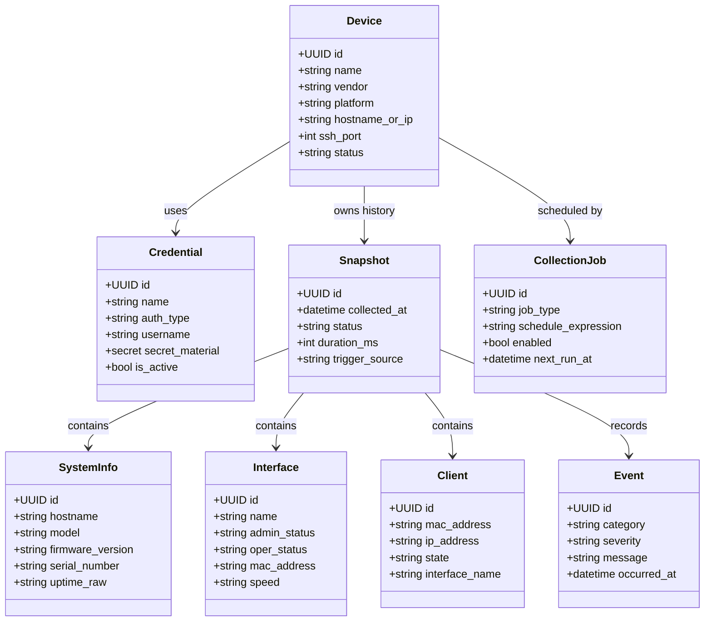
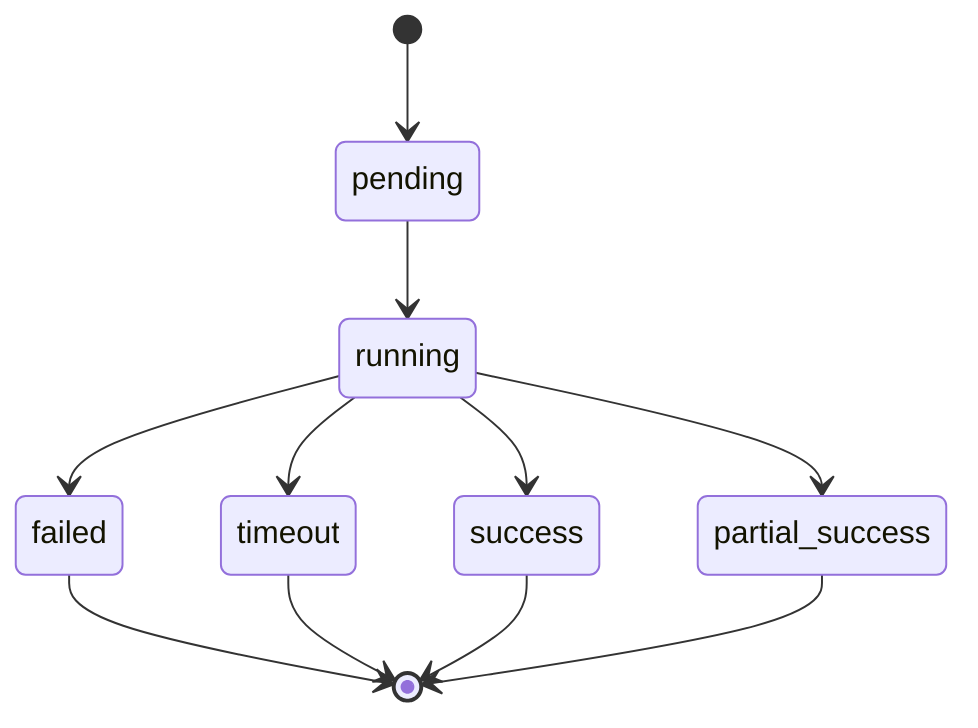

# Modelo de Domínio

## Objetivo

Definir o modelo conceitual principal do OpenNetManager para orientar entidades persistidas, contratos de serviço, payloads de API e semântica de parsing.

## Princípios de modelagem

- nomear entidades pelo significado operacional, não pela origem do vendor;
- distinguir claramente estado atual de histórico coletado;
- permitir expansão futura sem remodelagem destrutiva;
- evitar atributos genéricos opacos quando a semântica for conhecida;
- encapsular particularidades por vendor em metadados extensíveis, não no núcleo nominal.

## Entidades principais

### Device

Representa um ativo de rede gerenciado pela plataforma.

Responsabilidades conceituais:

- identificar o dispositivo no inventário;
- registrar vendor, plataforma e endpoint de conexão;
- associar credencial principal;
- guardar metadados administrativos e operacionais básicos;
- servir como agregado-raiz para snapshots e relações operacionais.

Atributos conceituais mínimos:

- id
- name
- vendor
- platform
- hostname_or_ip
- ssh_port
- status
- environment/tagging
- credential reference
- description
- timestamps

### Credential

Representa material de autenticação associado a um ou mais dispositivos.

Responsabilidades:

- definir tipo de autenticação;
- armazenar usuário e segredo protegido;
- permitir rotação e auditoria;
- separar segredo do restante do inventário.

### Snapshot

Representa uma coleta consistente executada para um dispositivo em um instante lógico.

Responsabilidades:

- delimitar uma execução de coleta;
- registrar status, duração, origem e versão de coleta;
- servir de contêiner histórico para SystemInfo, Interface, Client e Event correlacionáveis.

### SystemInfo

Representa informações de sistema coletadas de um dispositivo em um snapshot específico.

Exemplos conceituais:

- hostname reportado;
- modelo;
- vendor/plataforma observada;
- versão de firmware/OS;
- uptime;
- serial, quando disponível.

### Interface

Representa o estado coletado de uma interface no contexto de um snapshot.

Exemplos conceituais:

- nome lógico;
- descrição;
- MAC;
- MTU;
- estado administrativo;
- estado operacional;
- velocidade;
- counters suportados;
- VLAN ou associação relevante quando existir.

### Client

Representa cliente conectado ou observado pelo dispositivo, quando essa semântica for suportada pela plataforma.

Exemplos conceituais:

- identificador ou MAC do cliente;
- interface ou rádio associado;
- IP observado;
- estado;
- métricas suportadas;
- timestamps de observação.

### Event

Representa evento operacional, técnico ou de auditoria associado ao dispositivo ou a uma coleta.

Exemplos:

- falha de autenticação SSH;
- coleta concluída com sucesso;
- parsing parcial;
- credencial rotacionada;
- job desabilitado.

### CollectionJob

Representa uma definição persistida de coleta futura, manualmente acionável ou recorrente.

Responsabilidades:

- registrar tipo de coleta;
- registrar periodicidade/agenda;
- controlar habilitação;
- servir de base para scheduler futuro.

## Agregados sugeridos

### Agregado Device

`Device` é o agregado principal para inventário e eixo lógico de relacionamento. Credencial é associada, mas seu ciclo de segurança justifica tratamento cuidadoso separado. Snapshots se relacionam a Device como histórico, não como estado embutido único.

### Agregado Snapshot

`Snapshot` funciona como agregado histórico de coleta e pode conter ou referenciar `SystemInfo`, `Interface`, `Client` e `Event` correlatos. Isso preserva auditabilidade temporal e evita sobrescrever fatos operacionais com estado atual não versionado.

## Class Diagram

## State Diagram do snapshot

## Decisões importantes

### Histórico como entidade explícita

Snapshots são entidades de primeira classe porque a plataforma precisa rastrear quando e como um dado foi coletado. O trade-off é maior volume de dados e consultas mais complexas, porém isso é preferível a sobrescrever estado e perder auditabilidade.

### Dados normalizados por snapshot

Interfaces, clientes e system info devem ser relacionados ao snapshot específico em que foram observados. Isso evita inconsistência temporal entre tabelas e facilita depuração de regressões de parser.

### Event como domínio misto

`Event` é útil tanto para domínio operacional quanto para auditoria técnica. O trade-off é a necessidade futura de taxonomia clara para não misturar telemetria, auditoria e erro de sistema de forma caótica; essa taxonomia será aprofundada em documentação específica posterior.
