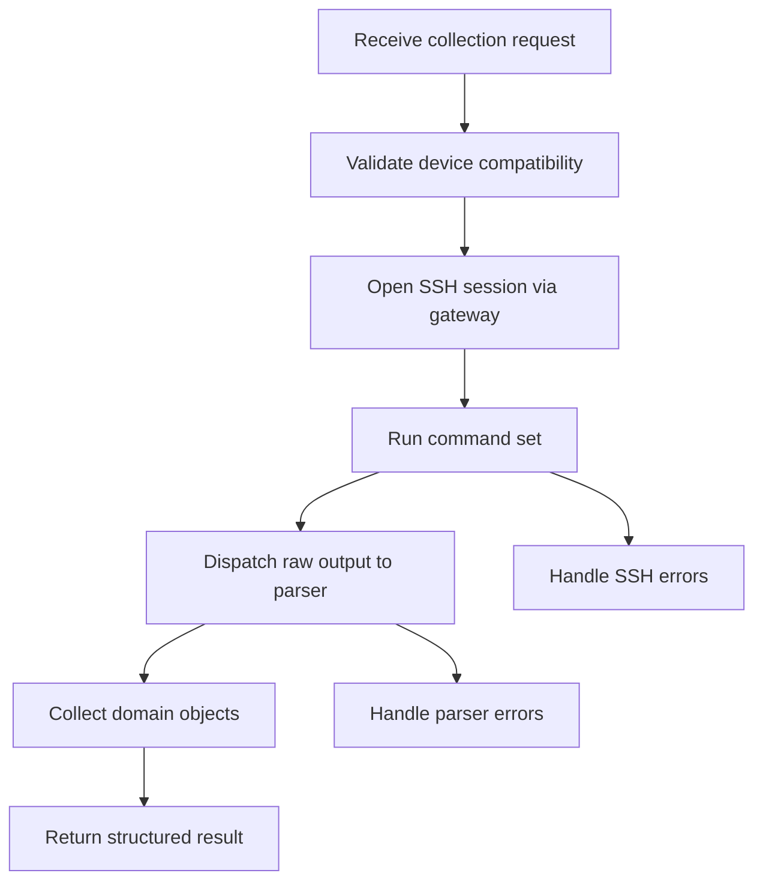
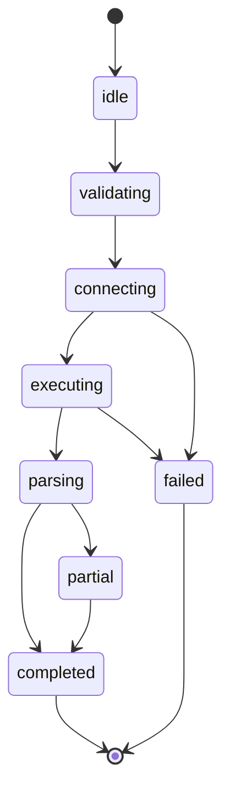

# Drivers

## Objetivo

Definir a arquitetura, responsabilidades e contratos dos drivers do OpenNetManager, garantindo que a integração com fabricantes permaneça desacoplada do núcleo do sistema.

## Papel do driver

O driver é o adaptador de plataforma responsável por:

- entender capabilities suportadas por determinado vendor/plataforma;
- selecionar comandos necessários;
- orquestrar o uso do SSH gateway;
- chamar parsers apropriados;
- devolver objetos de domínio estruturados ao service.

O driver não é responsável por:

- persistir dados;
- construir respostas HTTP;
- renderizar templates;
- abrir transações de banco;
- conter parsing inline além de casos triviais e explicitamente justificados.

## Contrato conceitual

Todo driver deve expor operações coerentes com as capabilities do projeto, como:

- testar conectividade;
- coletar system info;
- coletar interfaces;
- coletar clients quando suportado;
- executar snapshot agregado.

## BaseDriver

Deve existir um contrato base que padronize:

- identificação de vendor/plataforma;
- capabilities declaradas;
- validação de compatibilidade com `Device`;
- operações públicas suportadas;
- semântica de exceções.

## Capability model

Drivers devem preferir declarar explicitamente o que suportam. Isso é superior a assumir suporte universal e falhar tardiamente em tempo de execução.

Exemplos de capabilities:

- `system_info`
- `interfaces`
- `clients`
- `events_read`
- `config_backup` futuro

## AP130 como primeira implementação

O AP130 será o primeiro driver concreto, mas não define a abstração geral. Nenhum service, repository ou view pode depender de nome de comando, formato de saída ou semântica interna específicas do AP130.

## Driver registry/factory

A seleção de driver deve ocorrer em um componente centralizado que receba dados do dispositivo e devolva a implementação adequada. Essa centralização evita espalhar condicionais por todo o código e é pré-requisito para evolução futura, inclusive para possíveis plugins.

## Fluxo típico do driver

1. Validar compatibilidade do dispositivo.
2. Solicitar conexão ao SSH gateway.
3. Executar comandos previstos.
4. Encaminhar saídas aos parsers corretos.
5. Consolidar objetos estruturados.
6. Propagar sucesso, partial success ou falha com contexto.

## Diagramas

### Activity Diagram

### State Diagram do driver de coleta

## Trade-offs

### Driver gordo versus driver orquestrador

É tentador colocar parsing, validação de domínio e persistência no driver por conveniência. Isso acelera a primeira implementação, mas destrói reutilização e testabilidade. O projeto adota driver orquestrador porque a variação por vendor é inevitável e precisa permanecer isolada.
